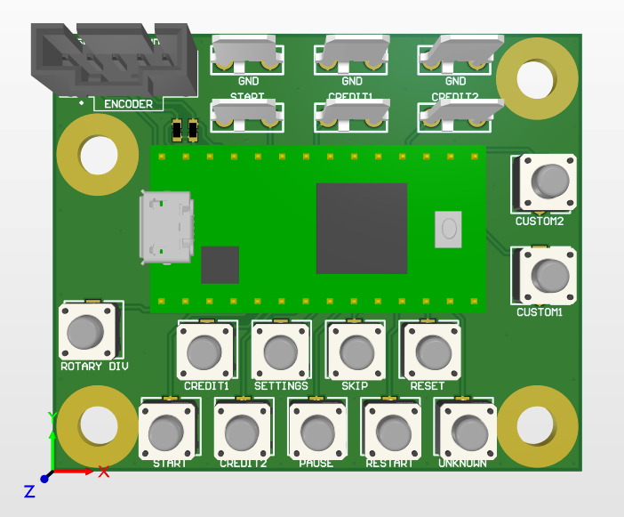
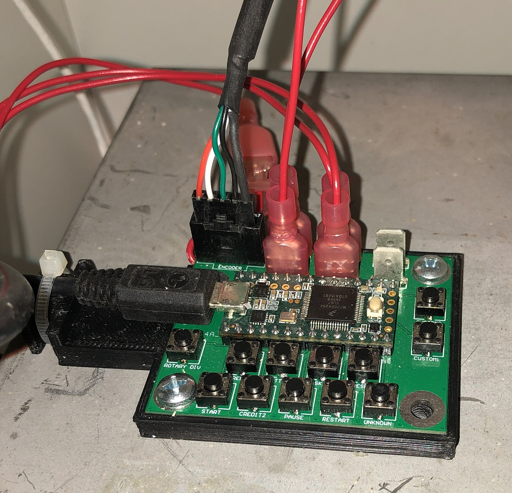
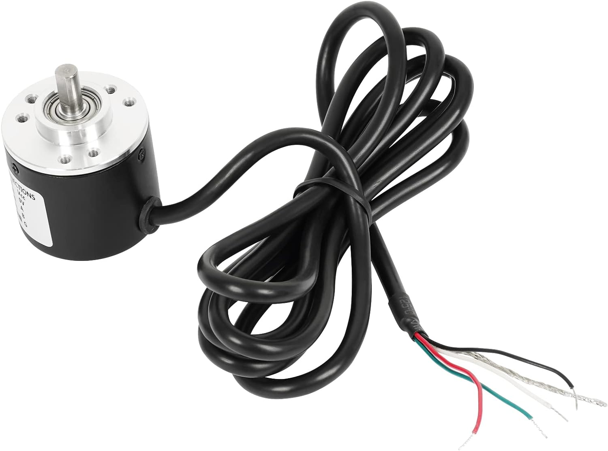

# The Act Interface PCB

This PCB provides an interface for The Act arcade game.  It uses a Teensy 3.2 (should also work with Teensy 4.0) for emulating the USB keyboard (button/switch inputs) and mouse (spinner input).  All of the functions are brought out to buttons, including ones that weren't intended for use, such as "pause", "skip scene", etc.

Included are:
- Gerbers
- BOM
- Schematics
- STL file for protective holder

Assembly is simple - solder the Teensy, buttons, encoder header (or solder encoder wires directly), and 0.250" quick disconnect terminals for control panel and coin door wiring (if using inside an arcade cabinet).

Most open collector rotary encoders should work.  I personally used this style: https://www.amazon.com/dp/B00Y9KDDCY/ , but I'd expect many arcade style spinners to work as well.  Note that the Teensy 3.2 has 5V tolerant inputs, but Teensy 4.0 does NOT.  So the rotary encoder should have OPEN COLLECTOR outputs ONLY, not push-pull outputs, to prevent overvoltage on the inputs.  There are pads for pullup resistors, though the MCU's internal pullups seem to be sufficient.  The encoder's pulse per rotation (P/R) count isn't very important since the sensitivity is adjustable using the ROTARY DIV button.

The pinout for the rotary encoder connector (wire color for linked Amazon encoder in parentheses) is:  
1: +5V (Red)  
2: Encoder A Output (white)  
3: Encoder B Output (green)  
4: GND (black)  
5: GND (bare wire)  

Pin 1 is marked with a dot and square pad, though check the image for confirmation (red wire is pin 1).

Firmware for the Teensy is included in the firmware directory of this repository.
